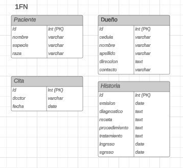
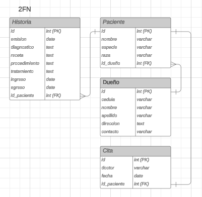
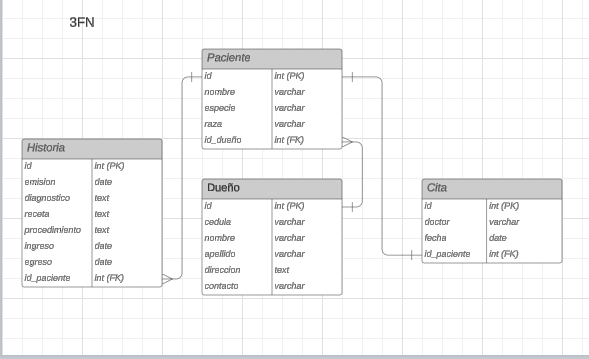

# Normalizacion de la BD
Dado el diagrama ER de la planificacion, se inicio con el proceso de normalizacion:

### 1FN
Para la primera forma normal, se verificaron los usos de los atributos claves, se transcribieron los datos a las tablas y, finalmente, se colocaron identificadores unicos para cada entidad.

Esquema en la 1FN

### 2FN
Para la segunda forma normal, se establecieron las respectivas relaciones entre tablas. Se tomo en cuenta la relacion entre Pcientes y Citas, no obstante la relacion con el propietario dado que no aporta nada al esquema.

Esquema en la 2FN

### 3FN
Para la tercera forma normal, se tomaron los atributos ambiguos (tratamiento, tabla historia) y se eliminaron de sus respectivas tablas.

Esquema en la 3FN