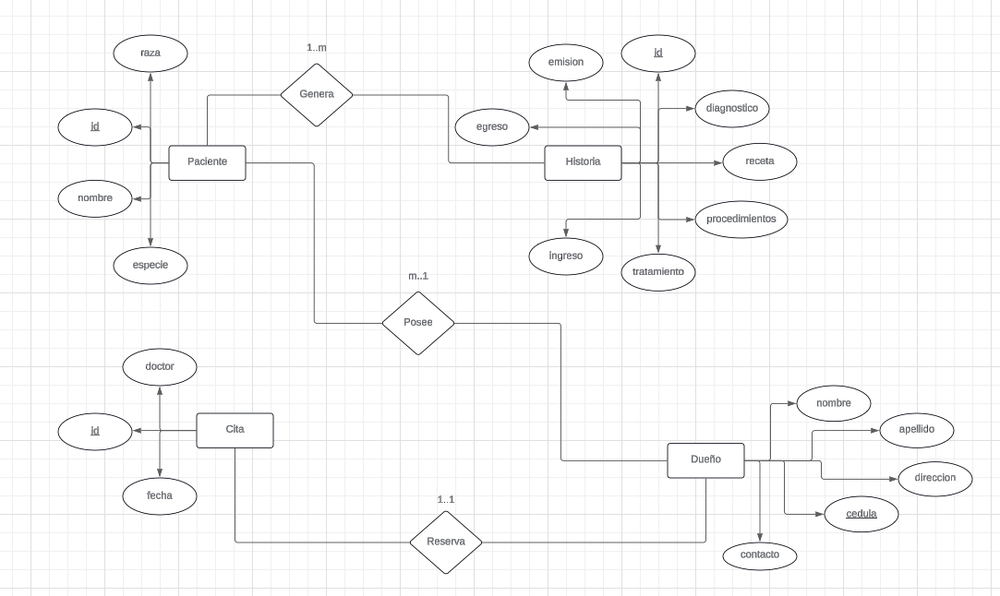

# Preparacion del esquema

Diagrama Entidad Relacion

El anterior diagrama ER provee el esquema bajo el cual se construiran las tablas dentro de las bases de datos, cada entidad posee al menos un atributo clave que les identifica, y sus relaciones se organizaron de la siguiente forma:

- Los Clientes (propietarios) se registran con su nombre y apellido, y se distinguen por su cedula. Opcionalmente estos pueden ser registrados con un numero de contacto y direccion. Un propietario puede tener varios animales (pacientes) agregados consigo.

- Los pacientes (animales) se registran con su nombre, especie y raza para posterior clasificacion. Se caracterizan mediante una id. Un paciente pertenece unicamente a un propietario.

- Las citas poseen cada una un identificador unico que las distingue de las demas, la fecha para la cual fueron asignadas y el nombre del doctor encargado para la misma. Una cita pertenece a un solo paciente y viceversa y son apartadas por el propietario.

- Las historias poseen el registro del procedimiento, medicamentos, diagnostico, entradas y salidas del paciente para una accion/operacion. Respectivamente, cada historia posee fechas de emision, Cada historia posee una id y pertenecen a un solo paciente.