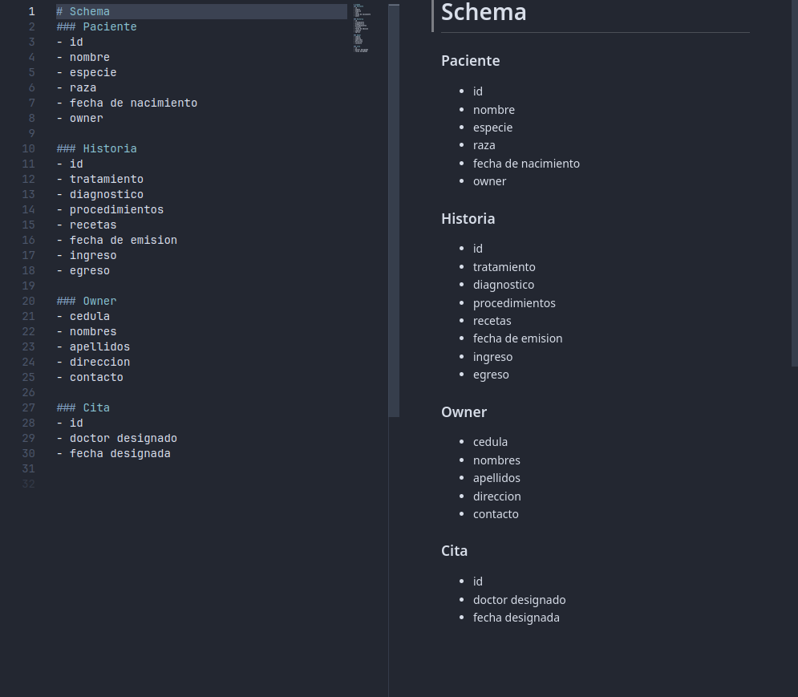

# Documentacion
La presente seccion describe el proceso de esquematizacion, graficado y normalizacion de la base de datos utilizada para la API:

- __PREPARATION__ incluye el diagrama ER para la planificacion de la base de datos.

- __NORMALIZATION__ incluye el proceso de normalizacion mediante el cual el diagrama fue depurado a las 3 formas normales.

El siguiente, es un bosquejo textual de la base de datos (aquellos elementos escenciales que debe tener la base de datos) cuyas caracteristicas fueron previamente clasificadas para evitar un paso adicional de organizacion.

Bosquejo

> A medida que se fue depurando e identificando las necesidades concretas para la base de datos, algunas de estas propiedades fueron movidas o trasladadas a otras tablas