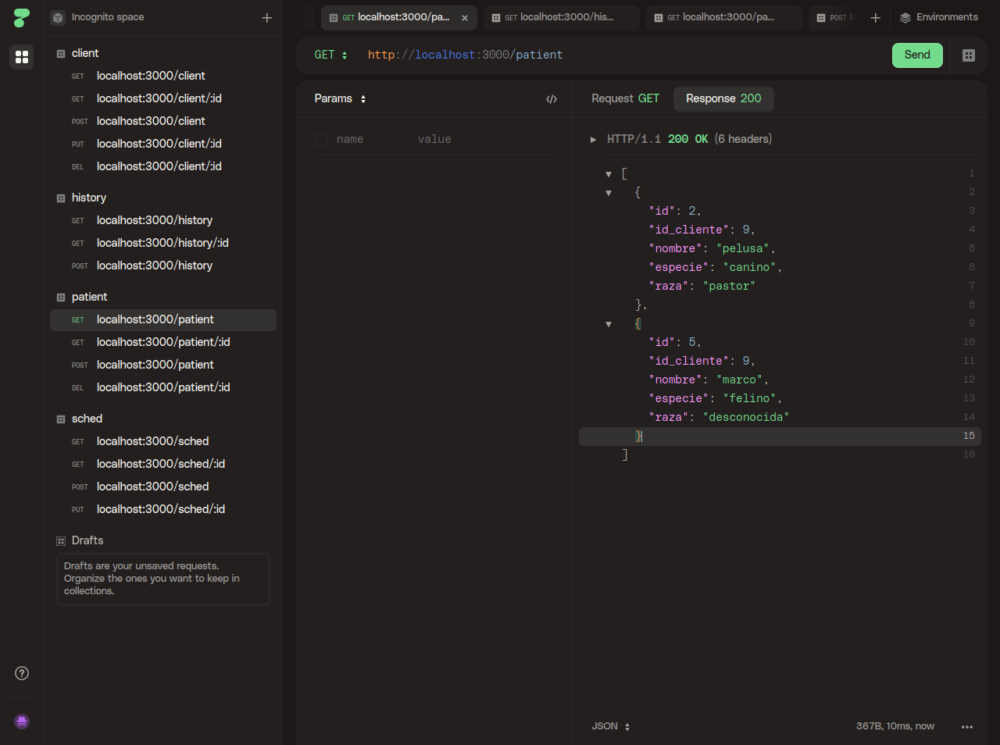
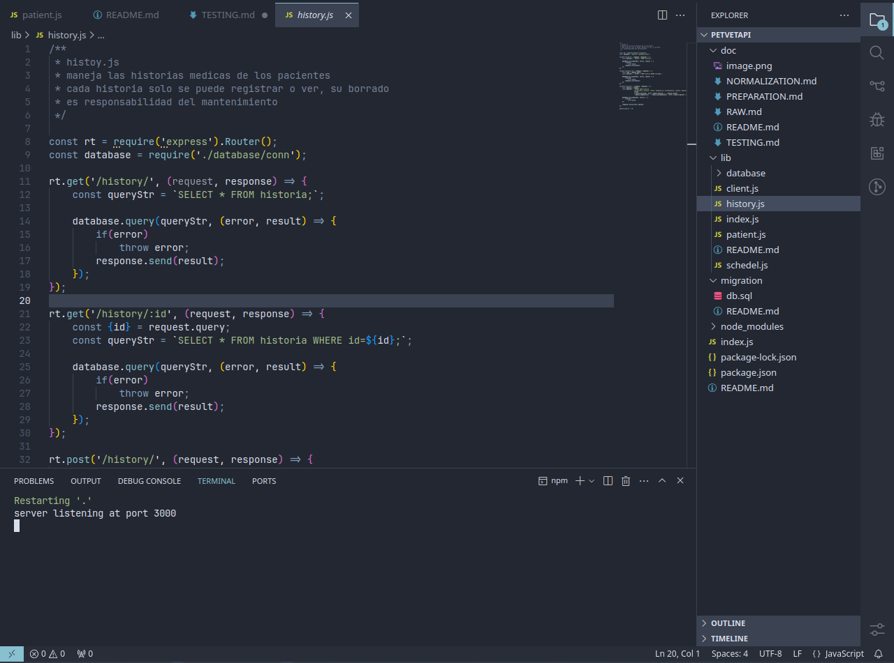

# Pruebas realizadas

HTTPie: pruebas a endpoints

VSCode: editor de codigo

Se realizaron las respectivas pruebas a la API y sus endpoints utilizando:

- VScode
- HTTPie

Ambas herramientas son de codigo abierto y uso libre. Disponibles en github y en sus paginas oficiales.

Para cada endpoint se realizaron 2 pruebas, cada una incluia un caso de error y un caso regular de peticion.

> En la imagen de HTTPie se puede observar un resumen de los endpoints probados 

Respecto al manejo de errores, cada endpoint por el momento maneja una excepcion en caso de que alguna peticion arroje algun error o en el caso de actualizacion o borrado, la id no sea valida. Por lo que el enviar una request erronea incurre en el cierre del servidor
(esto para evitar enviar requests en caso de errores fatales).
